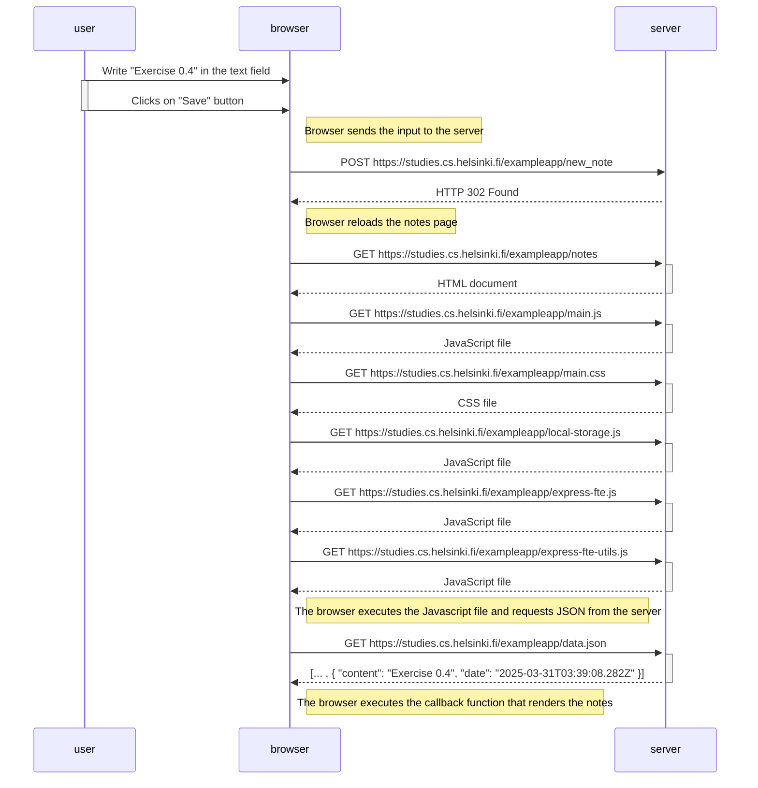

```mermaid
sequenceDiagram
    participant user
    participant browser
    participant server

    user->>browser: Write "Exercise 0.4"  in the text field
    activate user
    user->>browser: Clicks on "Save" button
    deactivate user
    Note right of browser: Browser sends the input to the server

    browser->>server: POST https://studies.cs.helsinki.fi/exampleapp/new_note 
    activate server
    server-->>browser: HTTP 302 Found

    Note right of browser: Browser reloads the notes page

    browser->>server: GET https://studies.cs.helsinki.fi/exampleapp/notes
    activate server
    server-->>browser: HTML document
    deactivate server

    browser->>server: GET https://studies.cs.helsinki.fi/exampleapp/main.js
    activate server
    server-->>browser: JavaScript file
    deactivate server

    browser->>server: GET https://studies.cs.helsinki.fi/exampleapp/main.css
    activate server
    server-->>browser: CSS file
    deactivate server

    browser->>server: GET https://studies.cs.helsinki.fi/exampleapp/local-storage.js
    activate server
    server-->>browser: JavaScript file
    deactivate server

    browser->>server: GET https://studies.cs.helsinki.fi/exampleapp/express-fte.js
    activate server
    server-->>browser: JavaScript file
    deactivate server

    browser->>server: GET https://studies.cs.helsinki.fi/exampleapp/express-fte-utils.js
    activate server
    server-->>browser: JavaScript file
    deactivate server

    Note right of browser: The browser executes the Javascript file and requests JSON from the server

    browser->>server: GET https://studies.cs.helsinki.fi/exampleapp/data.json
    activate server
    server-->>browser: [... , { "content": "Exercise 0.4", "date": "2025-03-31T03:39:08.282Z" }]
    deactivate server

    Note right of browser: The browser executes the callback function that renders the notes
```