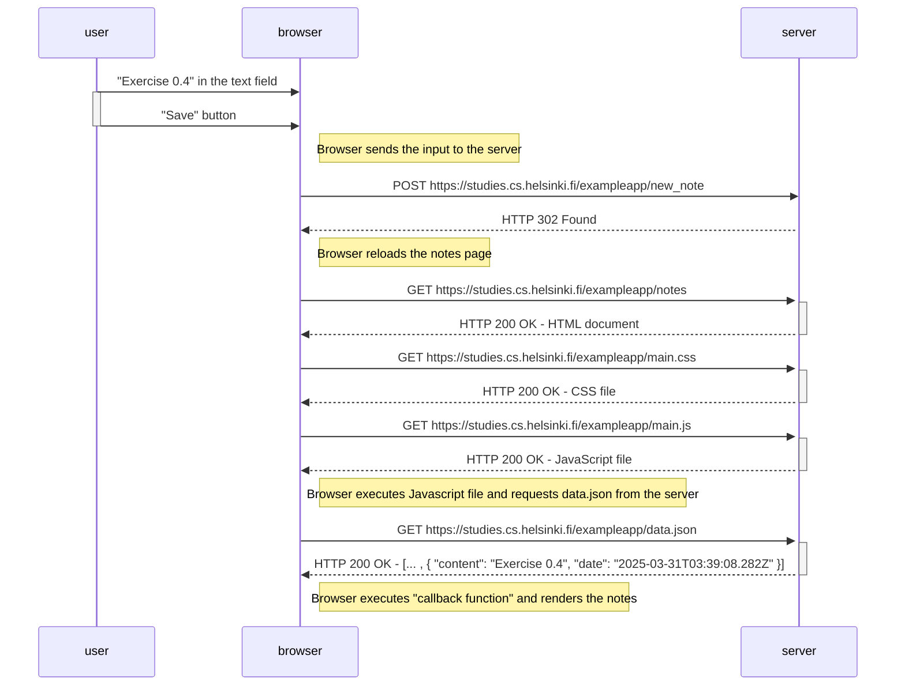

```mermaid
sequenceDiagram
    participant user
    participant browser
    participant server

    user->>browser: "Exercise 0.4"  in the text field
    activate user
    user->>browser: "Save" button
    deactivate user
    Note right of browser: Browser sends the input to the server

    browser->>server: POST https://studies.cs.helsinki.fi/exampleapp/new_note 
    activate server
    server-->>browser: HTTP 302 Found

    Note right of browser: Browser reloads the notes page

    browser->>server: GET https://studies.cs.helsinki.fi/exampleapp/notes
    activate server
    server-->>browser: HTTP 200 OK - HTML document
    deactivate server

    browser->>server: GET https://studies.cs.helsinki.fi/exampleapp/main.css
    activate server
    server-->>browser: HTTP 200 OK - CSS file
    deactivate server

    browser->>server: GET https://studies.cs.helsinki.fi/exampleapp/main.js
    activate server
    server-->>browser: HTTP 200 OK - JavaScript file
    deactivate server

    Note right of browser: Browser executes Javascript file and requests data.json from the server

    browser->>server: GET https://studies.cs.helsinki.fi/exampleapp/data.json
    activate server
    server-->>browser: HTTP 200 OK - [... , { "content": "Exercise 0.4", "date": "2025-03-31T03:39:08.282Z" }]
    deactivate server

    Note right of browser: Browser executes "callback function" and renders the notes
```
