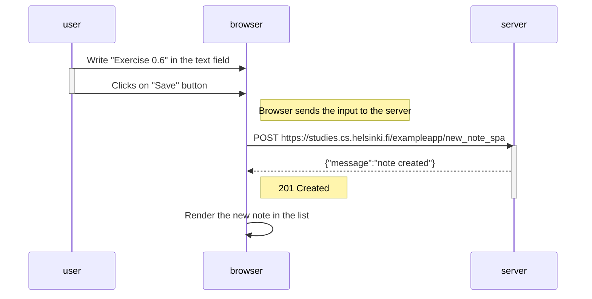

```mermaid
sequenceDiagram
    participant user
    participant browser
    participant server

   user->>browser: Write "Exercise 0.6"  in the text field
    activate user
    user->>browser: Clicks on "Save" button
    deactivate user
    Note right of browser: Browser sends the input to the server

    browser->>server: POST https://studies.cs.helsinki.fi/exampleapp/new_note_spa
    activate server
    server-->>browser: {"message":"note created"}
    Note right of browser: 201 Created
    deactivate server

    browser->>browser: Render the new note in the list
```